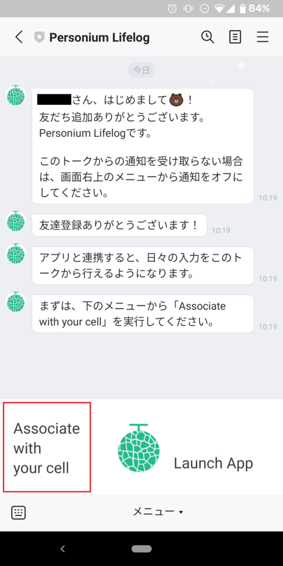
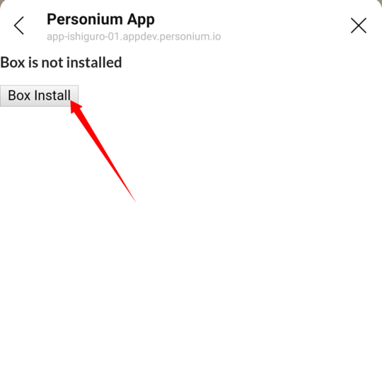
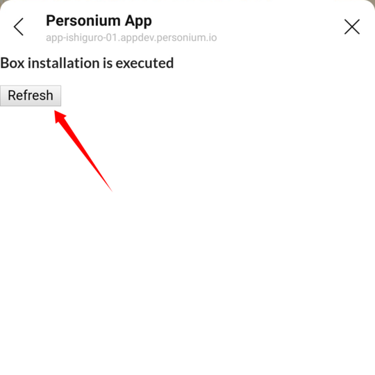
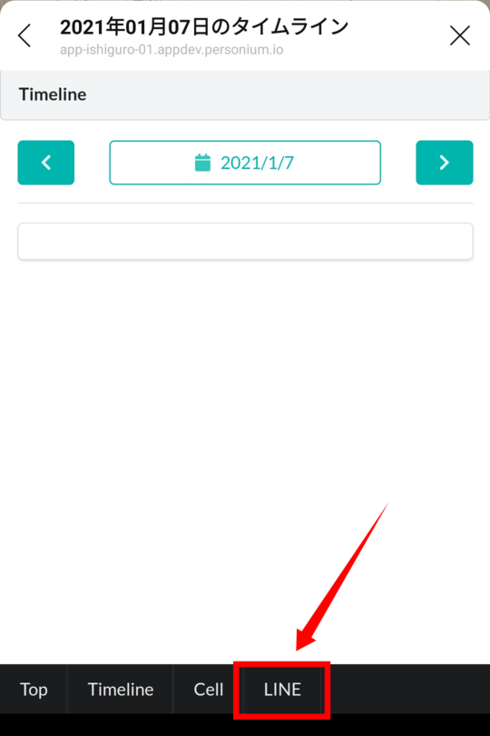
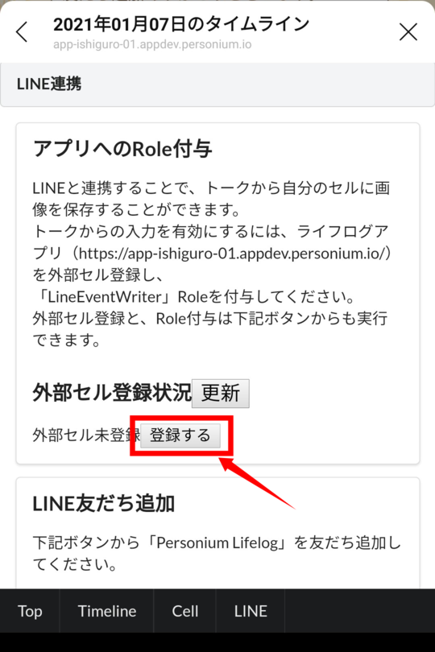
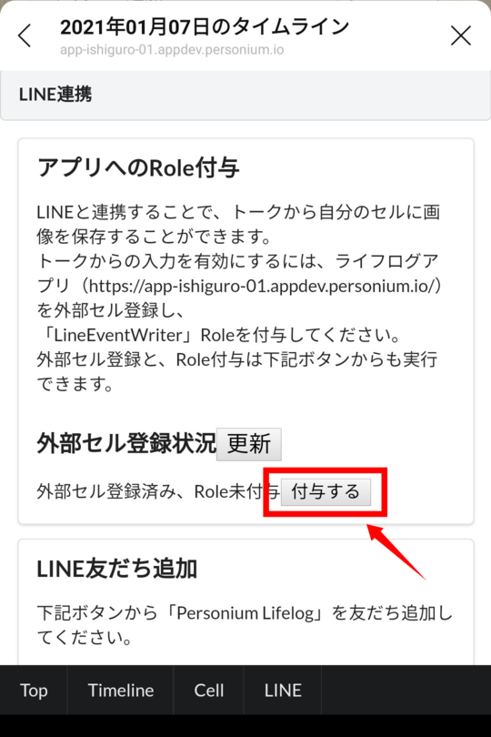
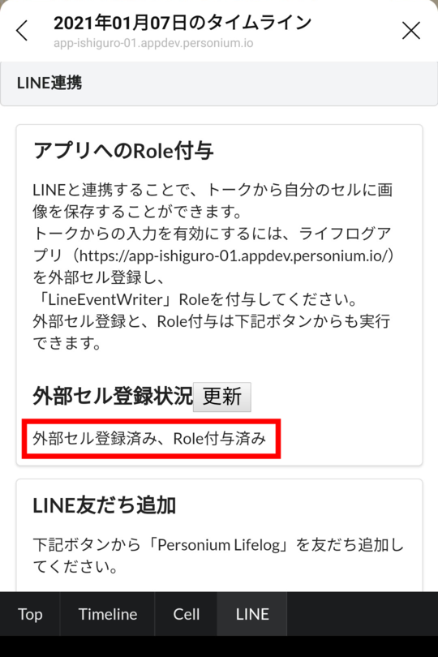

# app-personium-lifelog-line

Lifelog tool with chatapp. This is available from below URL: https://app-ishiguro-01.appdev.personium.io/__/front/app.

This application is developed from [personium-blank-app](https://github.com/personium/personium-blank-app).

## How to install to your PDS

If you have a Cell in `appdev.personium.io` Unit, you can start using Personium Lifelog.

### 1. Be a friend with `Personium Lifelog` in LINE App

To be a friend, use this link. [https://lin.ee/QMUvUFe](https://lin.ee/QMUvUFe)

### 2. Launch an application for association

From bottom menu, click `Associate with your cell`

### 3. Enter your cell URL

On opened page, input your cell URL and submit.

After submitting, application shows an authentication form to you. Enter your user which assigned `root` role and password to it.

### 4. Tap button to associate

Press `連携` button to associate.

### 5. Close application

After complete association, close application.

### 6. Launch main application

From bottom menu, click `Launch App`. If the association is done correctly, you'll be redirected to application (or login form).

At the first launch, screen for bar installation is shown. You can install application into your cell. Please tap `Refresh` button after starting installation.

After installation, you can see an empty timeline.

### 7. Assign role to app cell.

Before sending data, you must assign `LineEventWriter` role to `https://app-ishiguro-01.appdev.personium.io/` cell. You can use GUI for doing it.

1. First, open `LINE` tab.  

2. To register `https://app-ishiguro-01.appdev.personium.io/` as external cell onto your cell, click `登録する` button.

3. To assign `LineEventWriter` role to `https://app-ishiguro-01.appdev.personium.io/` ext cell, click `付与する` button.

You can see statuses like below after registration and assignment.

### 8. Send data from LINE application

You can save Photos and Texts by sending them to `Personium Lifelog` user in Line app.

Enjoy!
